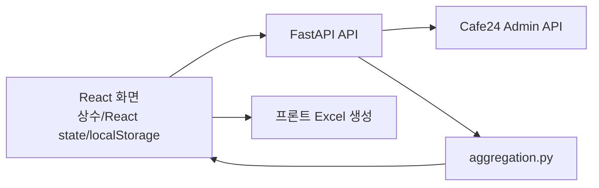
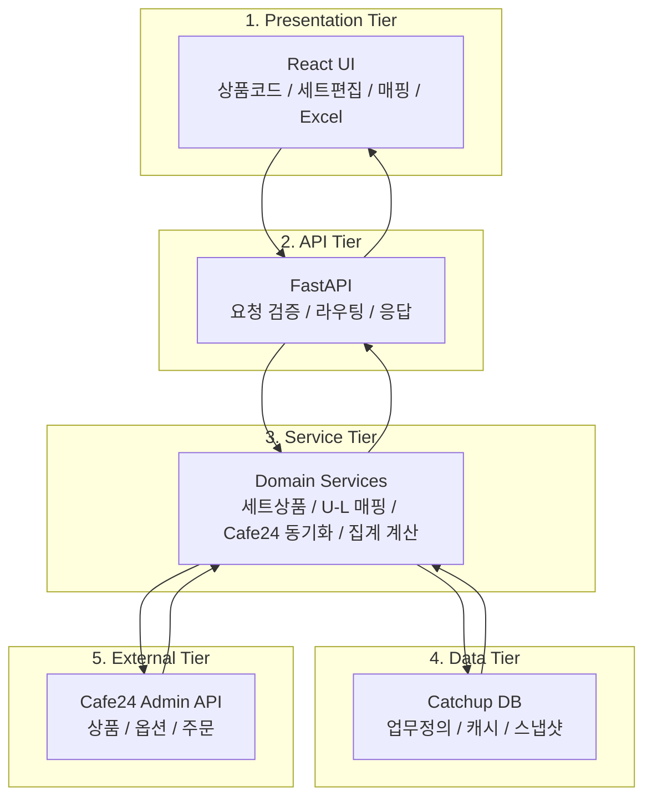
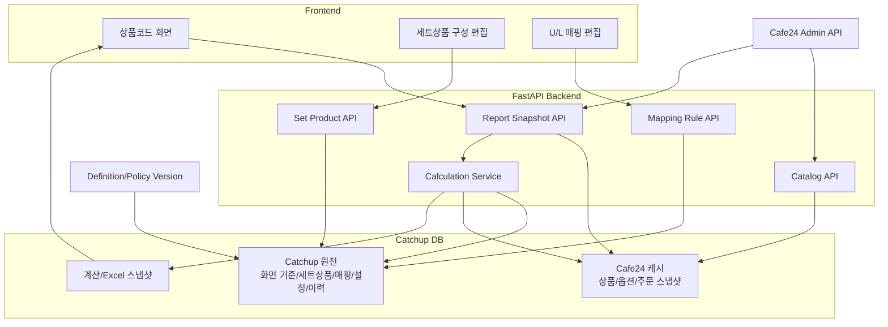
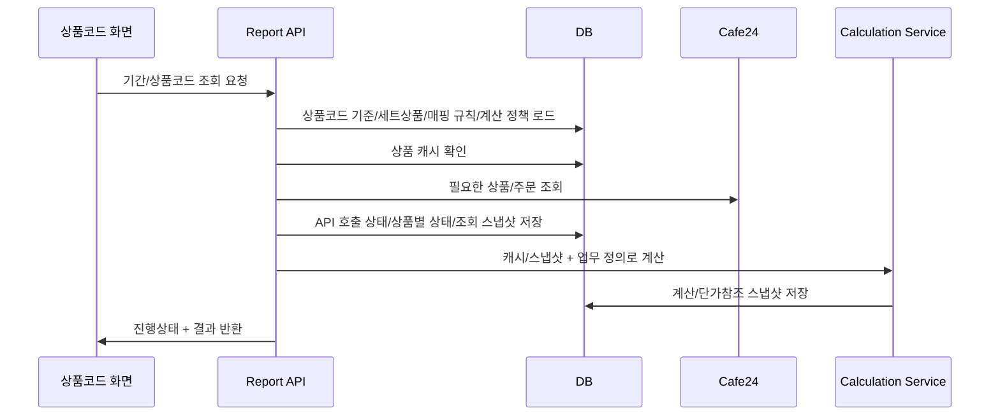
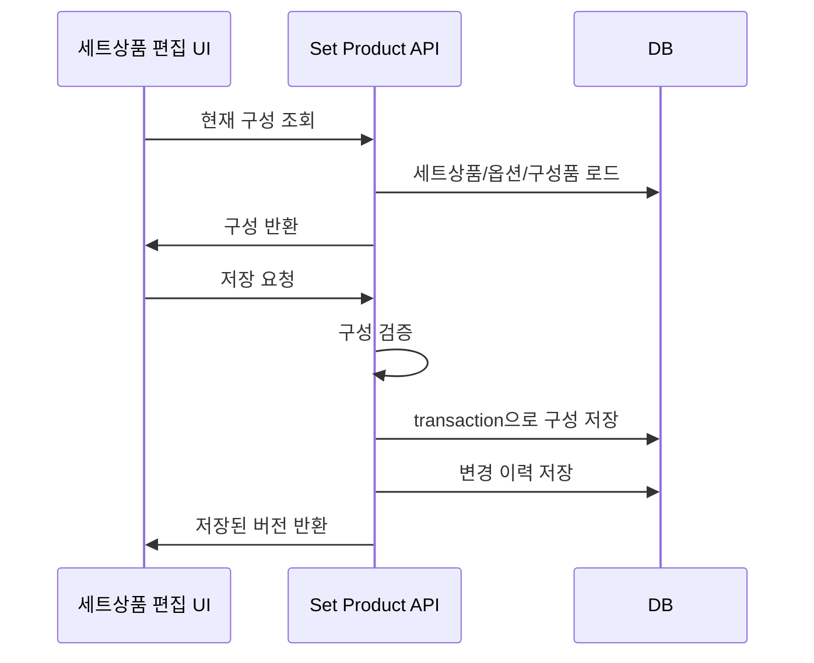
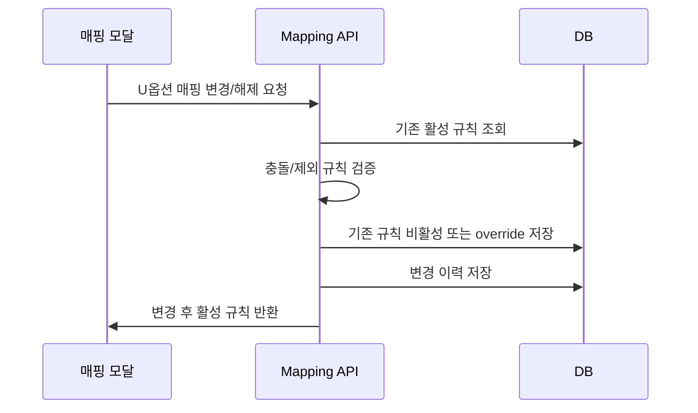

# Catchup 아키텍처 설계

## 1. 설계 목표

Catchup의 다음 단계 아키텍처 목표는 단순히 DB를 추가하는 것이 아니다.

현재 프론트 코드 상수와 브라우저 상태에 섞여 있는 업무 정의를 백엔드 도메인으로 이동하고, Cafe24 원천 데이터와 Catchup 고유 데이터를 분리해 재현 가능한 집계 시스템으로 바꾸는 것이다.

핵심 목표는 다음과 같다.

- Cafe24 상품/옵션/주문은 외부 원천으로 유지한다.
- 세트상품 구성, U/L 매핑, 상품코드 화면 기준은 Catchup 원천 데이터로 DB에 저장한다.
- 화면과 Excel은 같은 백엔드 계산 결과를 사용한다.
- 동일 기간/동일 규칙 기준의 결과를 다시 설명할 수 있어야 한다.
- Cafe24 장애, 응답 누락, 0값, 미확인 값을 사용자에게 구분해서 보여준다.
- UI 편집 결과는 새로고침, 배포, 브라우저 변경 후에도 유지된다.

## 2. 현재 구조의 한계

현재 구조는 다음과 같다.

한계:

- 세트상품 구성 `SET_PRODUCT_CONFIGS`가 프론트 코드에 있다.
- U/L 매핑 `RULES`가 프론트 코드에 있다.
- L상품 그룹, L상품 표시 fallback, Cafe24 조회 코드, U상품 컬럼 블록, 제외 U상품 정책도 프론트 코드에 있다.
- 세트상품 편집 초안과 매핑 override가 화면 state에만 있다.
- 백엔드는 Cafe24 조회와 단순 aggregation만 담당한다.
- `/api/products-report-requests`는 요청을 메모리에 10분만 보관한다.
- 화면 계산과 Excel 생성이 프론트에 커져 있어 업무 계산 기준이 분산된다.

이 구조는 "조회해서 보여주기"에는 충분하지만, "업무 정의를 저장하고 재현 가능한 결과를 만드는 시스템"에는 부족하다.

## 3. 목표 아키텍처

### 3.1 단순 Tier 구조

Catchup의 목표 아키텍처는 크게 5개 tier로 나눈다.

요약하면 `React UI -> FastAPI -> Domain Services -> Catchup DB / Cafe24` 구조다.

Catchup 고유 데이터는 DB에 저장하고, Cafe24 데이터는 외부 원천으로 조회/캐시한다.

### 3.2 상세 구성

## 4. 계층 책임

### 4.1 Frontend

프론트는 업무 정의의 원천이 아니다.

책임:

- 사용자 입력
- 화면 상호작용
- 임시 편집 draft
- 서버 응답 상태 표시
- 저장 실패/충돌/미확인 상태를 사용자가 이해할 수 있게 표현

프론트에서 제거할 책임:

- 세트상품 원천 정의 상수
- U/L 매핑 원천 정의 상수
- L그룹/U컬럼/조회 코드/제외 정책 원천 정의 상수
- 영속 override 관리
- 최종 업무 계산 기준의 독자 구현

초기 전환기에는 기존 상수를 fallback으로 둘 수 있지만, 안정화 후 제거한다.

### 4.2 Backend API

백엔드는 UI와 DB 사이의 단순 CRUD 계층이 아니라 업무 규칙의 관문이다.

책임:

- 세트상품 구성 저장 전 검증
- U/L 매핑 충돌 검증
- 상품코드 기준 세트 버전 관리
- 계산 정책 버전 관리
- Cafe24 조회/캐시/스냅샷 생성
- 화면과 Excel이 공유하는 계산 결과 생성
- 변경 이력 기록
- 오류 상태를 UI가 이해할 수 있는 응답으로 변환

### 4.3 Domain Service

도메인 서비스를 명시적으로 둔다.

권장 모듈:

- `backend/domains/catalog`: Cafe24 상품/옵션 캐시
- `backend/domains/sales`: 판매 조회와 주문 스냅샷
- `backend/domains/set_products`: 세트상품 정의
- `backend/domains/mapping`: U/L 매핑 규칙
- `backend/domains/product_codes`: 상품코드 화면 기준 세트
- `backend/domains/reporting`: 상품코드 화면/Excel 공통 계산
- `backend/shared/db`: DB 연결, transaction, migration helper

### 4.4 DB

DB는 두 종류의 데이터를 분리해서 담는다.

- Catchup 원천 데이터: 상품코드 기준, 세트상품, 매핑, 사용자 변경, 이력
- Cafe24 캐시/스냅샷: 상품/옵션/주문 원본과 정규화 결과

이 둘을 같은 테이블에 섞으면 안 된다. 예를 들어 Cafe24 상품명 캐시와 사용자가 정의한 세트상품 표시명은 별도 책임이다.

## 5. 주요 업무 흐름

### 5.1 상품코드 화면 조회

### 5.2 세트상품 구성 편집

### 5.3 U/L 매핑 변경

## 6. API 경계 설계

### 6.1 읽기 API

프론트가 화면 초기화에 필요한 정의를 한 번에 받는 endpoint를 둔다.

`GET /api/product-codes/definitions`

응답:

- 정의 세트 버전
- L상품 표시 그룹
- L상품 표시 fallback과 옵션/가격 후보
- U상품 컬럼 그룹
- Cafe24 조회 대상 코드 목록
- 세트상품 정의
- 활성 U/L 매핑 규칙
- 제외 규칙
- 매핑 규칙 세트 버전
- 계산 정책 버전

장점:

- 프론트 초기화 요청 수를 줄인다.
- 화면이 어떤 정의 버전으로 계산됐는지 추적할 수 있다.
- 기존 상수 제거 범위를 명확히 한다.

### 6.2 쓰기 API

쓰기 API는 도메인별로 나눈다.

- `PUT /api/set-products/{product_code}`
- `POST /api/mapping-rules/override`
- `POST /api/catalog/sync`
- `POST /api/report-snapshots`

쓰기 API는 반드시 변경 버전을 반환한다.

### 6.3 계산 API

화면과 Excel이 같은 계산 엔진을 쓰게 한다.

- `POST /api/product-codes/report-requests`
- `GET /api/product-codes/report-stream/{request_id}`
- `GET /api/product-codes/report-snapshots/{request_id}`
- `GET /api/product-codes/report-snapshots/{request_id}/excel`

현재 프론트 Excel 생성은 기능이 커질수록 계산 기준 분산 위험이 있다. 최종적으로 Excel도 백엔드 계산 snapshot 기준으로 생성하는 편이 맞다.

## 7. 데이터 버전 전략

결과 재현성을 위해 다음 버전을 기록한다.

- `catalog_snapshot_version`: Cafe24 상품/옵션 캐시 기준
- `sales_snapshot_id`: 기간 판매 조회 기준
- `definition_set_id`: L그룹/U컬럼/조회 코드/세트상품 기준
- `mapping_rule_set_id`: U/L 매핑 기준
- `calculation_policy_version_id`: 계산 로직 기준
- `report_calculation_snapshot_id`: 화면/Excel 계산 결과 기준

상품코드 화면 결과와 Excel 다운로드는 이 버전 묶음을 함께 가져야 한다.

## 8. 저장소 선택

1차는 SQLite가 적절하다.

이유:

- 현재 운영 규모와 구조가 단일 FastAPI 서버 중심이다.
- DB 운영 복잡도를 낮춰야 한다.
- 세트상품/매핑 정의는 데이터 규모가 작다.
- Cafe24 스냅샷도 초기에는 기간 단위로 관리 가능하다.

단, 다음 시점에는 PostgreSQL로 전환한다.

- 다중 사용자 동시 편집이 많아진다.
- 장기 주문 스냅샷이 커진다.
- 별도 배치/동기화 워커가 상시 동작한다.
- 권한/감사/운영 조회가 본격화된다.

SQLite 운영 조건:

- WAL 모드
- 배포 전 자동 백업
- DB 파일과 WAL/SHM 파일 백업 정책
- 마이그레이션 실패 시 배포 중단

## 9. 기준 버전 운영 정책

상품코드 기준 세트, 매핑 세트, 계산 정책 버전은 활성화 후 직접 수정하지 않는다.

운영 흐름:

1. 현재 active 세트를 복사해 draft를 만든다.
2. draft에서 상품코드 기준, 세트상품, 매핑 규칙을 수정한다.
3. 서버 검증을 통과하면 draft를 active로 전환한다.
4. 기존 active는 archived로 유지한다.
5. 판매 조회 snapshot은 생성 시점의 active 버전을 FK로 고정한다.
6. 기존 snapshot과 Excel은 기준 변경 후에도 기존 버전으로 재현한다.

이 정책 덕분에 화면/Excel 결과는 다음 조합으로 항상 설명 가능해야 한다.

- `definition_set_id`
- `mapping_rule_set_id`
- `calculation_policy_version_id`
- `sales_query_snapshot_id`
- `report_calculation_snapshot_id`

## 10. 구현 순서

### 1단계: 읽기 전환

- DB 인프라 추가
- 하드코딩 상품코드 기준/세트상품/매핑 seed
- 정의 조회 API 추가
- 프론트가 DB 정의를 읽도록 전환
- 기존 화면 결과와 완전히 동일함을 검증

### 2단계: 편집 저장

- 세트상품 구성 저장 API
- 매핑 override 저장 API
- 변경 이력 기록
- 새로고침 후 유지 검증

### 3단계: Cafe24 캐시

- 상품/옵션 캐시 저장
- 캐시 조회/갱신 상태 표시
- Cafe24 미확인 상품/옵션 UX 적용
- API 호출별 raw response와 오류 상태 저장
- requested product별 found/missing/failed/partial 상태 저장

### 4단계: 판매 스냅샷

- 기간 조회 request 저장
- 주문 라인 정규화 저장
- 주문 raw snapshot 저장
- 같은 request_id 재조회 지원
- Cafe24 실패 시 상태 UX 제공

### 5단계: 계산/Excel 통합

- 백엔드 calculation service로 화면/Excel 계산 기준 통합
- 계산 정책 버전과 단가 참조 snapshot 저장
- Excel을 snapshot 기준으로 생성
- 계산 버전 기록

## 11. 테스트 전략

DB 도입은 데이터 무결성 변경이므로 E2E를 생략할 수 없다.

필수 테스트:

- seed 후 기존 상품코드 화면과 동일한 결과가 나온다.
- L그룹/U컬럼/조회 코드/제외 정책이 DB seed 전후 동일하다.
- 세트상품 구성 저장 후 새로고침해도 유지된다.
- 세트상품 구성 삭제 후 계산 결과가 바뀌고 이력이 남는다.
- U/L 매핑 변경 후 새로고침해도 유지된다.
- U/L 매핑 해제 후 총판매/매출/수식 반영에서 제외된다.
- Cafe24 조회 실패 시 0으로 오인하지 않는다.
- 동일 snapshot 기준 Excel 결과가 재현된다.
- 기존 Excel 지원시트, defined name, 수식 결과가 DB 전환 전후 동일하다.
- DB 마이그레이션을 두 번 실행해도 중복 seed가 생기지 않는다.

## 12. 최종 판단

Catchup의 최적 아키텍처는 다음 방향이다.

- 프론트는 업무 정의 원천이 아니다.
- 백엔드 도메인 서비스가 업무 정의와 계산 기준을 책임진다.
- DB는 Catchup 원천과 Cafe24 캐시/스냅샷을 분리해서 저장한다.
- 상품코드 화면 기준 세트, 매핑 세트, 계산 정책 버전은 불변 참조로 관리한다.
- 화면과 Excel은 같은 계산 snapshot을 공유한다.
- 초기 DB는 SQLite로 작게 시작하되, 스키마는 PostgreSQL 전환을 막지 않게 설계한다.

이 구조가 현재 Catchup의 업무 크기와 운영 부담 사이에서 가장 현실적인 균형이다.
