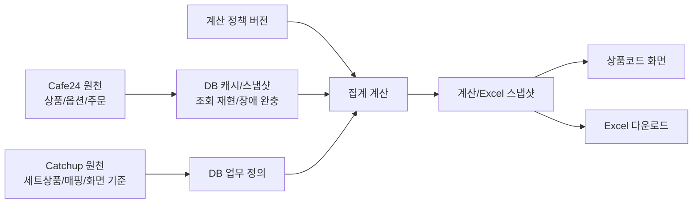

# Catchup DB 아키텍처 설계

## 1. 결론

DB 도입은 늦지 않았다. 오히려 지금이 적절하다.

현재 Catchup은 Cafe24에서 상품/주문 데이터를 가져와 화면에서 집계하고, 세트상품 구성과 U상품/L상품 매핑을 프론트 코드 상수와 화면 상태로 처리한다. 이 구조는 초기 검증에는 빠르지만, 다음 요구가 생긴 현재부터는 한계가 명확하다.

- 세트상품 구성은 Cafe24에 없는 Catchup 고유 업무 정의다.
- U상품과 L상품의 매핑 관계도 Cafe24에 없는 Catchup 고유 업무 정의다.
- 상품코드 화면의 L상품 그룹, U상품 컬럼, 조회 코드, 제외 정책도 업무 기준이다.
- 사용자가 편집한 세트상품 구성과 매핑 변경은 새로고침, 배포, 브라우저 변경, 서버 재시작에 안전하지 않다.
- 동일 기간을 다시 조회했을 때 Cafe24 응답 변화나 누락 때문에 과거 화면/Excel 결과를 설명하기 어렵다.

따라서 DB는 다음 세 책임으로 시작한다.

1. Catchup 원천 데이터 저장: 세트상품 정의, U/L 매핑 규칙, 상품코드 화면 기준, 사용자 override, 변경 이력.
2. Cafe24 캐시/스냅샷 저장: 상품/옵션 메타데이터, 기간별 판매 조회 원본/정규화 결과, 조회 상태.
3. 결과 재현 정보 저장: 계산 정책 버전, 화면/Excel 계산 snapshot, 단가 참조 snapshot.

처음부터 Cafe24를 대체하는 업무 원장으로 만들면 안 된다. Cafe24 원천과 Catchup 원천을 분리해야 한다.

## 2. 현재 코드에서 확인한 사실

### 2.1 Cafe24 조회

백엔드 `backend/shared/cafe24.py`는 Cafe24 Admin API에서 다음 데이터를 가져온다.

- 카테고리: `/categories`
- 상품: `/products`, `embed=variants`
- 옵션 상세 가격 보강: `/products/{product_no}/variants`
- 주문: `/orders`, `embed=items`

`backend/shared/aggregation.py`는 주문 item의 `variant_code`, `quantity`, `claim_quantity`, `product_price`, `option_price`, `order_status`를 이용해 상품/옵션별 수량과 매출을 계산한다.

현재 Cafe24 응답, 호출 상태, 주문 raw payload, 상품별 조회 성공/누락 상태는 저장되지 않는다.

### 2.2 백엔드 조회 요청 상태

`backend/domains/sales/routes.py`의 `/api/products-report-requests`는 긴 상품코드 목록을 URL에 싣지 않기 위해 요청을 메모리에 등록한다.

- 저장 위치: 프로세스 메모리
- TTL: 10분
- 서버 재시작 시 유실
- 조회 완료 결과 저장 없음

이 구조는 실시간 조회에는 충분하지만, 과거 조회 재현이나 장애 복구에는 부족하다.

### 2.3 세트상품 정의

`frontend/src/pages/ProductCodesView.tsx`의 `SET_PRODUCT_CONFIGS`는 다음 정보를 프론트 코드 상수로 가지고 있다.

- 세트상품 코드
- 세트상품명
- 세트 옵션 코드/옵션명
- 공통 구성품
- 옵션별 구성품
- 구성품 L상품 코드
- 구성품 옵션 코드
- 수량
- 세트가

이 관계는 Cafe24에 존재하지 않는다. DB 도입 시 Catchup 원천 데이터로 저장해야 한다.

### 2.4 U/L 매핑 규칙

`ProductCodesView.tsx`와 `ExcelOrderView.tsx`의 `RULES`는 U상품 판매량을 L상품 집계 기준으로 연결하는 규칙이다.

- U상품 코드
- U상품 옵션 코드
- L상품 코드
- L상품 옵션 코드
- 반영 비율

이 관계도 Cafe24에 존재하지 않는다. DB 원천 데이터로 저장해야 한다.

### 2.5 상품코드 화면 기준표

세트상품과 매핑 외에도 상품코드 화면의 업무 기준은 여러 프론트 상수에 분산되어 있다.

- `L_GROUPS`: L상품 행 그룹과 표시 순서
- `L_PRODUCT_DISPLAY_BY_CODE`: L상품명, 옵션명, fallback 가격
- `QUERY_CODES`: Cafe24 조회 대상 코드
- `U_BLOCKS`: U상품 컬럼 그룹과 표시 순서
- `EXCLUDED_U_PRODUCTS`: 집계/수식에서 제외하는 U상품 정책

이 기준표들이 DB 밖에 남으면 DB 도입 후에도 행 구성, 열 구성, 조회 범위, 표시 후보, 제외 정책이 코드 배포에 묶인다. 따라서 세트상품/매핑과 같은 1차 원천화 범위에 포함한다.

### 2.6 사용자 변경 상태

현재 화면 상태로만 존재하는 데이터가 있다.

- 세트상품 구성 편집 초안: `setComponentDrafts`, `setAddedComponents`
- U/L 매핑 override: `luOverrides`
- 상품코드 보기 모드: `localStorage`
- 공통 조회 설정: `catchup-settings-v1` localStorage

세트상품 구성과 매핑 override는 업무 데이터이므로 DB 저장 대상이다. 보기 모드와 기간 설정은 운영 편의 데이터이므로 우선순위를 낮게 둔다.

## 3. DB 저장 대상 분류

### 3.1 DB 원천 데이터

DB가 원천이어야 하는 데이터다. Cafe24에서 복구할 수 없다.

| 영역 | 저장 대상 | 이유 |
| --- | --- | --- |
| 상품코드 화면 기준 | L그룹, U컬럼 블록, 조회 코드, 표시 fallback, 제외 정책 | 화면 구조와 계산 대상의 업무 기준 |
| 세트상품 정의 | 세트상품, 옵션, 공통/옵션별 구성품, 수량, 세트가 | Cafe24에 관계 정의가 없음 |
| 세트상품 변경 이력 | 구성품 추가/수정/삭제, 적용 기간, 변경자 | 과거 계산 설명과 감사 필요 |
| U/L 매핑 규칙 | U상품/옵션과 L상품/옵션 관계, 비율, 활성 상태 | Cafe24에 매핑 개념이 없음 |
| 매핑 override | 사용자가 기본 규칙을 해제하거나 다른 L상품으로 변경한 내용 | 코드 상수로 둘 수 없는 운영 변경 |
| 제외/비활성 규칙 | 총판매/매출/수식에서 제외할 U상품/옵션 | 업무 판단 데이터 |
| 계산 정책 | 취소/반품 제외, claim 차감, 가격 결정, 옵션 정규화 | 결과 재현의 핵심 기준 |

### 3.2 DB 캐시/스냅샷 데이터

Cafe24가 원천이지만 DB에 보관해야 하는 데이터다.

| 영역 | 저장 대상 | 이유 |
| --- | --- | --- |
| 상품/옵션 메타데이터 | product_no, product_code, product_name, variant_code, option_name, 가격 후보, raw_json | 화면 표시, 세트 구성 선택, Cafe24 장애 완충 |
| 판매 조회 스냅샷 | 조회 기간, 요청 코드 목록, 응답 상태, 완료 시각, 오류 | 동일 조회 재현 |
| API 호출 상태 | endpoint, page/offset, 요청 파라미터, 응답 상태, 오류 | 누락/부분/실패 상태 구분 |
| 요청 상품별 상태 | requested product_code별 found/missing/failed/partial | 실제 0과 미확인 구분 |
| 주문 raw snapshot | order 단위 raw payload | 파싱 오류 추적, 재처리 |
| 주문 라인 정규화 | order_id, item_code, product_code, variant_code, 수량, 클레임수량, 가격, 상태 | 집계 근거 보존 |

### 3.3 파생 데이터

저장할 수 있지만 원천으로 삼으면 안 되는 데이터다.

| 영역 | 저장 대상 | 판단 |
| --- | --- | --- |
| 계산 결과 스냅샷 | 조회 당시 화면/Excel 집계 결과 | P1. 재현성과 감사 목적상 저장 |
| 단가 참조 스냅샷 | 매출 계산에 사용한 price reference/support-sheet 입력 | P1. 화면/Excel 수식 설명에 필요 |
| Excel 다운로드 이력 | 다운로드 시각, 기간, 규칙 버전, 파일 해시 | P1. Excel 재현성 목적상 저장 |

### 3.4 저장하지 않을 데이터

| 영역 | 예시 | 이유 |
| --- | --- | --- |
| UI 일시 상태 | hover, 선택 셀, 열린 모달 위치, 스크롤 | 업무 데이터가 아님 |
| 임시 초안 | 저장/적용 전 편집 중 값 | 브라우저 상태로 충분. 단 자동 복구가 필요해지면 별도 draft 테이블 검토 |

## 4. 권장 DB 선택

운영 DB는 tars에 이미 설치되어 실행 중인 PostgreSQL 16을 사용한다.

### 4.1 tars DB 실사 결과

2026-06-26 tars 서버 확인 결과는 다음과 같다.

| DB | 상태 | 포트 | 판단 |
| --- | --- | --- | --- |
| PostgreSQL 16.14 | 실행 중 | `127.0.0.1:5432` | Catchup 운영 DB로 채택 |
| MySQL 8.0.46 | 실행 중 | `127.0.0.1:3306`, `127.0.0.1:33060` | 사용하지 않음 |
| MongoDB 8.0.20 | 실행 중 | `0.0.0.0:27017` | 사용하지 않음 |
| Redis 7.0.15 | 실행 중 | `127.0.0.1:6379` | 주 DB로 사용하지 않음. 향후 락/큐/캐시 보조 가능 |
| SQLite 3.45.1 | CLI/라이브러리 설치 | 파일 DB | 운영 주 DB로 사용하지 않음. 테스트 보조 가능 |

현재 Catchup은 tars의 어떤 DB에도 연결되어 있지 않다.

MongoDB에는 `docupload`, `aims_analytics` 등 기존 다른 서비스로 보이는 DB가 있다. Catchup은 이 DB를 재사용하지 않고, PostgreSQL에 전용 database/user/schema를 새로 만든다.

### 4.2 PostgreSQL을 선택하는 이유

- 이미 tars에 PostgreSQL 16이 설치되어 있고 서비스가 실행 중이다.
- 세트상품, 매핑, 기준 세트, 스냅샷은 FK와 transaction이 중요한 관계형 데이터다.
- JSONB로 Cafe24 raw response, 계산 snapshot, 단가 참조 snapshot을 저장할 수 있다.
- unique constraint, partial index, migration, advisory lock, backup 도구가 성숙하다.
- 향후 동시 편집, 감사 로그, 권한 모델, 배치 작업으로 확장해도 SQLite보다 안전하다.
- 새 DB 엔진을 추가 설치하지 않아도 되므로 운영 부담이 낮다.

### 4.3 다른 DB를 선택하지 않는 이유

- MySQL: 가능은 하지만 PostgreSQL의 JSONB, partial index, advisory lock, migration 생태계가 Catchup 설계에 더 잘 맞는다.
- MongoDB: 세트상품/매핑/기준 세트/스냅샷이 FK와 강한 정합성을 요구하므로 주 DB로 부적절하다. 기존 MongoDB DB도 다른 서비스용으로 보인다.
- Redis: 휘발성 캐시/락/큐에는 적합하지만 업무 원천 데이터 저장소가 아니다.
- SQLite: DB가 전혀 없는 단일 서버 초기안으로는 가능했지만, tars에 PostgreSQL이 이미 있으므로 운영 주 DB로 선택할 이유가 약하다.

### 4.4 권장 운영 구성

- engine: PostgreSQL 16
- database: `catchup`
- role/user: `catchup_app`
- schema: `app`
- connection: `localhost:5432`
- backend driver: SQLAlchemy + Alembic + `psycopg`
- migration lock: PostgreSQL advisory lock 사용
- backup: `pg_dump` 또는 custom format `pg_dump -Fc`
- raw/snapshot JSON: JSONB 사용

권한 원칙:

- `catchup_app`은 `app` schema 내 필요한 DML 권한만 가진다.
- DB 생성/마이그레이션 소유자는 별도 관리자 또는 배포 계정으로 분리할 수 있다.
- 기존 `docupload`, `aims_analytics`, MySQL, MongoDB 데이터에는 접근하지 않는다.

### 4.5 운영 조건

- 배포 전 `pg_dump` 백업
- migration 전후 schema version 확인
- 마이그레이션 실패 시 앱 시작 차단 또는 배포 중단
- PostgreSQL 서비스 health check 추가
- DB 접속 정보는 환경변수 또는 서버 전용 `.env`로 관리하고 git에 커밋하지 않음
- tars 외부에서 PostgreSQL 포트를 직접 열지 않음

### 4.6 prod/dev/test 분리

운영과 개발/테스트 DB는 반드시 분리한다.

| 환경 | DB |
| --- | --- |
| production | tars PostgreSQL의 `catchup` database |
| development | 로컬 PostgreSQL 또는 tars와 분리된 개발 DB |
| test | 테스트 전용 PostgreSQL database. 단위 테스트 일부는 SQLite in-memory 허용 |

운영 DB를 개발 테스트에 직접 사용하지 않는다.

### 4.7 백업/복구 정책

1차 운영 기준:

- 마이그레이션 전 `pg_dump -Fc` 백업을 만든다.
- 배포 후 schema version과 앱 health check를 확인한다.
- 월 1회 이상 restore 리허설을 수행한다.
- 백업 파일은 운영 서버 사용자만 읽을 수 있게 권한을 제한한다.
- 백업 파일에는 Cafe24 주문/고객 관련 raw payload가 포함될 수 있으므로 외부 공유를 금지한다.

PITR(point-in-time recovery)는 1차 구현 blocker는 아니지만, 판매 snapshot 저장량과 운영 중요도가 커지면 검토한다.

### 4.8 보안 정책

PostgreSQL 운영 착수 전 최소 보안 기준은 다음과 같다.

- 앱은 DB superuser를 사용하지 않는다.
- `catchup_app`은 `app` schema에 필요한 권한만 가진다.
- DB 접속 정보는 git에 커밋하지 않는다.
- Cafe24 raw response에는 주문자/수령자/연락처/주소 등 개인정보 또는 거래정보가 포함될 수 있으므로 raw 저장 전 필드 목록을 점검한다.
- raw response 접근 API는 기본 제공하지 않는다. 운영자 진단용이 필요하면 별도 권한을 둔다.
- raw response 보관 기간은 180일로 제한하고, 이후 삭제 또는 압축 아카이브한다.
- 백업 파일은 OS 권한으로 보호하고, 필요 시 암호화 보관한다.
- 로그에는 DB password, Cafe24 token, raw 개인정보를 출력하지 않는다.

## 5. 논리 스키마

### 5.1 공통 규칙

모든 업무 원천 테이블은 다음 공통 컬럼을 가진다.

| 컬럼 | 의미 |
| --- | --- |
| `id` | 내부 PK |
| `created_at` | 생성 시각 |
| `updated_at` | 수정 시각 |
| `deleted_at` | 소프트 삭제 시각 |
| `created_by` | 변경자. 계정 도입 전에는 `system` 또는 `local` |
| `updated_by` | 마지막 변경자 |

상품/옵션 코드는 Cafe24 문자열을 그대로 저장하되 비교용 정규화는 애플리케이션에서 일관되게 수행한다.

### 5.1.1 PostgreSQL 물리 타입 규칙

논리 스키마의 타입은 PostgreSQL에서 다음 기준으로 구현한다.

| 논리 타입 | PostgreSQL 타입 |
| --- | --- |
| `integer PK` | `bigint generated by default as identity primary key` |
| `datetime` | `timestamptz` |
| `date` | `date` |
| `json/text` | `jsonb` |
| `numeric` 수량 | `numeric(12,3)` |
| `numeric` 금액 | `numeric(14,2)` |
| 코드/상태 문자열 | `text` + check constraint 또는 enum |
| boolean | `boolean` |

제약/인덱스 원칙:

- active 기준 세트는 partial unique index로 1개만 허용한다.
- active 매핑 세트도 partial unique index로 1개만 허용한다.
- 적용 기간 중복은 1차에서는 애플리케이션 검증으로 막고, 필요 시 PostgreSQL exclusion constraint를 추가한다.
- FK는 업무 정의 삭제를 막기 위해 기본적으로 `restrict`를 사용한다.
- history/audit 테이블은 원본 row 삭제와 무관하게 보존한다.
- snapshot 하위 데이터는 snapshot 삭제 정책이 확정되기 전까지 cascade delete를 사용하지 않는다.

### 5.2 불변 기준 세트

#### `product_code_definition_sets`

상품코드 화면이 사용하는 업무 기준 묶음이다. 조회 스냅샷은 반드시 이 정의 세트를 참조한다.

| 컬럼 | 타입 | 설명 |
| --- | --- | --- |
| `id` | integer PK | 내부 ID |
| `version` | text unique | 불변 정의 버전 |
| `status` | text | `draft`, `active`, `archived` |
| `description` | text nullable | 변경 설명 |
| `activated_at` | datetime nullable | 활성화 시각 |
| `created_at` | datetime | 생성 시각 |

#### `mapping_rule_sets`

| 컬럼 | 타입 | 설명 |
| --- | --- | --- |
| `id` | integer PK | 내부 ID |
| `version` | text unique | 불변 매핑 세트 버전 |
| `definition_set_id` | integer FK | 상품코드 기준 세트 |
| `status` | text | `draft`, `active`, `archived` |
| `activated_at` | datetime nullable | 활성화 시각 |

#### `calculation_policy_versions`

`aggregate()`에 들어 있는 업무 규칙을 버전으로 고정한다.

| 컬럼 | 타입 | 설명 |
| --- | --- | --- |
| `id` | integer PK | 내부 ID |
| `version` | text unique | 계산 정책 버전 |
| `status_exclude_json` | json/text | 제외 주문 상태. 예: C/R/F |
| `quantity_policy` | text | 예: `quantity_minus_claim_quantity` |
| `price_policy` | text | 예: `product_price_plus_option_price` |
| `unit_price_policy` | text | 예: `first_nonzero_else_catalog` |
| `variant_normalization_policy` | text | 옵션 코드 정규화 규칙 |
| `source_commit` | text nullable | 코드 기준 커밋 |
| `created_at` | datetime | 생성 시각 |

### 5.3 상품코드 화면 기준 원천

#### `l_product_groups`

| 컬럼 | 타입 | 설명 |
| --- | --- | --- |
| `id` | integer PK | 내부 ID |
| `definition_set_id` | integer FK | 기준 세트 |
| `category` | text | 화면 카테고리 |
| `label` | text | 그룹 라벨. 예: 500g, 1kg |
| `sort_order` | integer | 표시 순서 |

#### `l_product_group_items`

| 컬럼 | 타입 | 설명 |
| --- | --- | --- |
| `id` | integer PK | 내부 ID |
| `group_id` | integer FK | L그룹 |
| `product_code` | text | L상품 코드 |
| `sort_order` | integer | 표시 순서 |

#### `l_product_display_overrides`

| 컬럼 | 타입 | 설명 |
| --- | --- | --- |
| `id` | integer PK | 내부 ID |
| `definition_set_id` | integer FK | 기준 세트 |
| `product_code` | text | L상품 코드 |
| `display_name` | text nullable | Cafe24 캐시를 보완하는 표시명 |
| `variant_code` | text nullable | 옵션 코드 |
| `variant_name` | text nullable | 옵션명 fallback |
| `fallback_price` | numeric nullable | Cafe24 가격 미확인 시 표시/계산 후보 |

#### `u_product_blocks`

| 컬럼 | 타입 | 설명 |
| --- | --- | --- |
| `id` | integer PK | 내부 ID |
| `definition_set_id` | integer FK | 기준 세트 |
| `product_code` | text | U상품 코드 |
| `product_label` | text | U상품 표시명 |
| `group_type` | text | `conversion`, `set` |
| `sort_order` | integer | 컬럼 블록 표시 순서 |

#### `u_product_block_options`

| 컬럼 | 타입 | 설명 |
| --- | --- | --- |
| `id` | integer PK | 내부 ID |
| `block_id` | integer FK | U상품 블록 |
| `variant_code` | text | U상품 옵션 코드 |
| `sort_order` | integer | 컬럼 표시 순서 |

#### `product_query_codes`

| 컬럼 | 타입 | 설명 |
| --- | --- | --- |
| `id` | integer PK | 내부 ID |
| `definition_set_id` | integer FK | 기준 세트 |
| `product_code` | text | Cafe24 조회 대상 상품코드 |
| `reason` | text | `l_product`, `u_product`, `set_component`, `manual` |

#### `excluded_u_products`

| 컬럼 | 타입 | 설명 |
| --- | --- | --- |
| `id` | integer PK | 내부 ID |
| `definition_set_id` | integer FK | 기준 세트 |
| `product_code` | text | 제외 U상품 코드 |
| `variant_code` | text nullable | 옵션 단위 제외 시 사용 |
| `reason` | text nullable | 제외 사유 |

### 5.4 Cafe24 상품 캐시

#### `catalog_products`

| 컬럼 | 타입 | 설명 |
| --- | --- | --- |
| `id` | integer PK | 내부 ID |
| `cafe24_product_no` | integer nullable | Cafe24 product_no |
| `product_code` | text unique | Cafe24 product_code |
| `product_name` | text | 상품명 |
| `base_price` | numeric | Cafe24 상품 기준가 |
| `is_active` | boolean | Cafe24 조회 기준 활성 여부 |
| `last_synced_at` | datetime | 마지막 동기화 시각 |
| `raw_json` | json/text | Cafe24 원본 상품 응답 |

#### `catalog_product_options`

| 컬럼 | 타입 | 설명 |
| --- | --- | --- |
| `id` | integer PK | 내부 ID |
| `product_id` | integer FK | `catalog_products.id` |
| `variant_code` | text | Cafe24 variant_code |
| `option_suffix` | text | 화면에서 쓰는 A/B/CI 같은 옵션 코드 |
| `option_name` | text | 옵션명 |
| `price` | numeric | 옵션 단가 후보 |
| `last_synced_at` | datetime | 마지막 동기화 시각 |
| `raw_json` | json/text | Cafe24 원본 옵션 응답 |

권장 제약:

- unique(`product_id`, `variant_code`)
- index(`product_code`)
- index(`option_suffix`)

### 5.5 세트상품 원천

#### `set_products`

| 컬럼 | 타입 | 설명 |
| --- | --- | --- |
| `id` | integer PK | 내부 ID |
| `definition_set_id` | integer FK | 기준 세트 |
| `product_code` | text | 세트 U상품 코드 |
| `product_name` | text | 세트상품 표시명. Cafe24명 캐시와 다를 수 있음 |
| `status` | text | `active`, `inactive` |
| `definition_version` | integer | 구성 변경 버전 |
| `effective_from` | date nullable | 적용 시작일 |
| `effective_to` | date nullable | 적용 종료일 |

권장 제약:

- unique(`definition_set_id`, `product_code`)

#### `set_product_options`

| 컬럼 | 타입 | 설명 |
| --- | --- | --- |
| `id` | integer PK | 내부 ID |
| `set_product_id` | integer FK | `set_products.id` |
| `variant_code` | text | 세트 U상품 옵션 코드 |
| `option_name` | text | 세트 옵션명 |
| `sort_order` | integer | 화면 표시 순서 |
| `status` | text | `active`, `inactive` |

권장 제약:

- unique(`set_product_id`, `variant_code`)

#### `set_product_components`

| 컬럼 | 타입 | 설명 |
| --- | --- | --- |
| `id` | integer PK | 내부 ID |
| `set_product_id` | integer FK | 세트상품 |
| `set_option_id` | integer FK nullable | 옵션별 구성이면 값 있음 |
| `scope` | text | `common`, `option` |
| `component_product_code` | text | 구성 L상품 코드 |
| `component_option_code` | text | 구성 L상품 옵션 코드 |
| `quantity` | numeric | 세트 1개당 구성 수량 |
| `set_price` | numeric | 세트가 |
| `sort_order` | integer | 표시 순서 |
| `status` | text | `active`, `inactive` |
| `effective_from` | date nullable | 적용 시작일 |
| `effective_to` | date nullable | 적용 종료일 |

의미 규칙:

- `scope='common'`이면 `set_option_id`는 null이다.
- `scope='option'`이면 `set_option_id`가 반드시 있어야 한다.
- `component_product_code/component_option_code`는 Cafe24 상품 캐시를 참조할 수 있지만, FK로 강제하지 않는 편이 안전하다. Cafe24 상품이 삭제되어도 과거 정의는 남아야 한다.

#### `set_product_component_history`

| 컬럼 | 타입 | 설명 |
| --- | --- | --- |
| `id` | integer PK | 내부 ID |
| `component_id` | integer nullable | 변경 대상 component |
| `set_product_id` | integer | 세트상품 |
| `action` | text | `create`, `update`, `delete`, `restore` |
| `before_json` | json/text | 변경 전 값 |
| `after_json` | json/text | 변경 후 값 |
| `changed_at` | datetime | 변경 시각 |
| `changed_by` | text | 변경자 |

### 5.6 U/L 매핑 원천

#### `mapping_rules`

| 컬럼 | 타입 | 설명 |
| --- | --- | --- |
| `id` | integer PK | 내부 ID |
| `mapping_rule_set_id` | integer FK | 매핑 세트 |
| `u_product_code` | text | U상품 코드 |
| `u_option_code` | text | U상품 옵션 코드 |
| `l_product_code` | text | L상품 코드 |
| `l_option_code` | text nullable | L상품 옵션 코드 |
| `ratio` | numeric | 반영 비율 |
| `rule_type` | text | `base`, `user_override` |
| `status` | text | `active`, `disabled` |
| `reason` | text nullable | 해제/변경 사유 |
| `effective_from` | date nullable | 적용 시작일 |
| `effective_to` | date nullable | 적용 종료일 |

권장 제약:

- index(`mapping_rule_set_id`, `u_product_code`, `u_option_code`)
- index(`l_product_code`, `l_option_code`)
- 같은 기간에 동일 U옵션의 활성 기본 규칙이 중복되지 않도록 애플리케이션 검증

#### `mapping_rule_history`

| 컬럼 | 타입 | 설명 |
| --- | --- | --- |
| `id` | integer PK | 내부 ID |
| `mapping_rule_id` | integer nullable | 변경 대상 rule |
| `action` | text | `create`, `update`, `disable`, `replace`, `delete` |
| `before_json` | json/text | 변경 전 |
| `after_json` | json/text | 변경 후 |
| `changed_at` | datetime | 변경 시각 |
| `changed_by` | text | 변경자 |

### 5.7 판매 조회 스냅샷

#### `sales_query_snapshots`

| 컬럼 | 타입 | 설명 |
| --- | --- | --- |
| `id` | integer PK | 내부 ID |
| `request_id` | text unique | 조회 요청 ID |
| `start_date` | date | 조회 시작일 |
| `end_date` | date | 조회 종료일 |
| `requested_codes_json` | json/text | 요청한 상품코드 목록 |
| `status` | text | `running`, `succeeded`, `failed`, `partial` |
| `source` | text | `cafe24` |
| `definition_set_id` | integer FK | 상품코드 화면 기준 세트 |
| `mapping_rule_set_id` | integer FK | 매핑 규칙 세트 |
| `calculation_policy_version_id` | integer FK | 계산 정책 버전 |
| `started_at` | datetime | 시작 시각 |
| `completed_at` | datetime nullable | 완료 시각 |
| `error_message` | text nullable | 실패 메시지 |

#### `cafe24_api_calls`

| 컬럼 | 타입 | 설명 |
| --- | --- | --- |
| `id` | integer PK | 내부 ID |
| `snapshot_id` | integer FK | 조회 스냅샷 |
| `endpoint` | text | 호출 endpoint |
| `request_params_json` | json/text | 요청 파라미터 |
| `page_offset` | integer nullable | page/offset |
| `status` | text | `succeeded`, `failed`, `partial` |
| `http_status` | integer nullable | HTTP 상태 |
| `started_at` | datetime | 시작 시각 |
| `completed_at` | datetime nullable | 완료 시각 |
| `error_message` | text nullable | 오류 |
| `raw_response_json` | json/text nullable | 원본 응답 |

#### `sales_requested_products`

| 컬럼 | 타입 | 설명 |
| --- | --- | --- |
| `id` | integer PK | 내부 ID |
| `snapshot_id` | integer FK | 조회 스냅샷 |
| `product_code` | text | 요청 상품코드 |
| `status` | text | `found`, `missing`, `failed`, `partial` |
| `catalog_product_id` | integer nullable | 매칭된 상품 캐시 |
| `message` | text nullable | 상태 설명 |

#### `sales_order_raw_snapshots`

| 컬럼 | 타입 | 설명 |
| --- | --- | --- |
| `id` | integer PK | 내부 ID |
| `snapshot_id` | integer FK | 조회 스냅샷 |
| `order_id` | text | Cafe24 주문 ID |
| `order_status` | text nullable | 주문 상태 |
| `raw_json` | json/text | 주문 원본 |

#### `sales_order_lines`

| 컬럼 | 타입 | 설명 |
| --- | --- | --- |
| `id` | integer PK | 내부 ID |
| `snapshot_id` | integer FK | `sales_query_snapshots.id` |
| `order_id` | text | Cafe24 주문 ID |
| `order_item_code` | text nullable | Cafe24 주문 item 코드 |
| `product_code` | text | 상품 코드 |
| `variant_code` | text | 옵션 코드 |
| `quantity` | numeric | 주문 수량 |
| `claim_quantity` | numeric | 클레임 수량 |
| `effective_quantity` | numeric | 계산 반영 수량 |
| `product_price` | numeric | Cafe24 product_price |
| `option_price` | numeric | Cafe24 option_price |
| `effective_unit_price` | numeric | 계산 단가 |
| `order_status` | text | Cafe24 주문 상태 |
| `included_in_sales` | boolean | 집계 포함 여부 |
| `raw_json` | json/text | Cafe24 item 원본 |

### 5.8 계산/Excel 결과

#### `report_calculation_snapshots`

| 컬럼 | 타입 | 설명 |
| --- | --- | --- |
| `id` | integer PK | 내부 ID |
| `sales_query_snapshot_id` | integer FK | 판매 조회 스냅샷 |
| `calculation_policy_version_id` | integer FK | 계산 정책 버전 |
| `result_json` | json/text | 화면/Excel 집계 결과 |
| `price_reference_json` | json/text | 매출 단가 참조와 support-sheet 입력 |
| `created_at` | datetime | 생성 시각 |

이 테이블은 P1이다. 과거 화면/Excel 결과를 설명해야 하므로 선택 사항으로 두지 않는다.

#### `excel_exports`

| 컬럼 | 타입 | 설명 |
| --- | --- | --- |
| `id` | integer PK | 내부 ID |
| `calculation_snapshot_id` | integer FK | 계산 결과 |
| `filename` | text | 파일명 |
| `file_hash` | text nullable | 산출물 해시 |
| `exported_at` | datetime | 다운로드 시각 |

### 5.9 사용자 설정

#### `user_settings`

| 컬럼 | 타입 | 설명 |
| --- | --- | --- |
| `id` | integer PK | 내부 ID |
| `user_key` | text | 계정 전에는 `default` |
| `settings_key` | text | `product_codes_view`, `sales_report` 등 |
| `settings_json` | json/text | 설정 값 |
| `updated_at` | datetime | 수정 시각 |

초기에는 localStorage 유지가 가능하다. 여러 PC/브라우저에서 같은 운영 설정을 공유해야 할 때 DB로 이동한다.

## 6. API 설계

### 6.1 상품코드 정의

프론트가 화면 초기화에 필요한 정의를 한 번에 받는 endpoint를 둔다.

`GET /api/product-codes/definitions`

응답:

- L상품 그룹
- L상품 표시 fallback과 옵션 목록
- U상품 컬럼 그룹
- Cafe24 조회 대상 코드 목록
- 세트상품 정의
- 활성 U/L 매핑 규칙
- 제외 규칙
- 정의 세트 버전
- 매핑 규칙 세트 버전
- 계산 정책 버전

### 6.2 세트상품

| Method | Path | 용도 |
| --- | --- | --- |
| GET | `/api/set-products` | 세트상품 목록과 옵션/구성 조회 |
| GET | `/api/set-products/{product_code}` | 단일 세트상품 구성 조회 |
| PUT | `/api/set-products/{product_code}` | 세트상품 전체 구성 저장 |
| POST | `/api/set-products/{product_code}/components` | 구성품 추가 |
| PATCH | `/api/set-products/{product_code}/components/{component_id}` | 구성품 수정 |
| DELETE | `/api/set-products/{product_code}/components/{component_id}` | 구성품 비활성화 |
| GET | `/api/set-products/{product_code}/history` | 변경 이력 조회 |

초기 구현은 `PUT /api/set-products/{product_code}` 단일 저장으로 시작해도 된다. 단, 저장 시 전체 구성 검증과 변경 이력 기록은 반드시 포함한다.

### 6.3 매핑 규칙

| Method | Path | 용도 |
| --- | --- | --- |
| GET | `/api/mapping-rules` | 현재 활성 매핑 규칙 조회 |
| PUT | `/api/mapping-rules` | 규칙 세트 저장 |
| POST | `/api/mapping-rules/override` | 특정 U옵션 매핑 변경/해제 |
| GET | `/api/mapping-rules/history` | 변경 이력 조회 |

### 6.4 Cafe24 캐시/조회

| Method | Path | 용도 |
| --- | --- | --- |
| POST | `/api/catalog/sync` | 상품/옵션 캐시 갱신 |
| GET | `/api/catalog/products` | 캐시된 상품/옵션 조회 |
| POST | `/api/sales-query-snapshots` | 기간 판매 조회 생성 |
| GET | `/api/sales-query-snapshots/{request_id}/stream` | 진행 상황 SSE |
| GET | `/api/sales-query-snapshots/{request_id}` | 저장된 조회 결과 조회 |

기존 `/api/products-report-requests`는 새 snapshot API로 감싸거나 점진적으로 대체한다.

## 7. 마이그레이션 계획

### 1단계: DB 인프라만 추가

- PostgreSQL 접속 설정과 DB 연결 모듈 추가
- 마이그레이션 도구 추가
- health/status endpoint 추가
- 기존 기능 동작 변경 없음

완료 기준:

- tars PostgreSQL에 `catchup` database, `catchup_app` role, `app` schema 생성 가능
- 마이그레이션 재실행이 idempotent
- `pg_dump` 백업 절차 문서화

### 2단계: 하드코딩 데이터 seed

- `SET_PRODUCT_CONFIGS`를 seed 데이터로 DB에 이관
- `RULES`를 seed 데이터로 DB에 이관
- `L_GROUPS`, `L_PRODUCT_DISPLAY_BY_CODE`, `QUERY_CODES`, `U_BLOCKS`, `EXCLUDED_U_PRODUCTS`를 seed 데이터로 DB에 이관
- TypeScript 상수에서 직접 seed하지 않고 JSON seed 원본을 만든 뒤 프론트/백엔드가 같은 원본을 공유하도록 전환
- seed는 여러 번 실행해도 중복 생성하지 않음
- seed 버전 기록

완료 기준:

- DB에서 읽은 데이터가 기존 코드 상수와 동일한 화면/계산 결과를 만든다.
- 기존 E2E 화면값, Excel 수식, 지원시트 결과가 동일하다.
- 기존 상수 fallback을 일시적으로 유지한다.

### 3단계: 프론트 조회 경로 전환

- 상품코드 화면이 상품코드 정의, 세트상품 정의, 매핑 규칙을 API에서 읽는다.
- API 실패 시 사용자에게 "DB 정의 조회 실패"를 명확히 표시한다.
- 임시 fallback은 운영 안정화 후 제거한다.

완료 기준:

- 새로고침 후에도 세트상품 구성과 매핑 규칙이 동일하다.
- 기존 E2E의 상품코드 화면 결과가 유지된다.

### 4단계: 편집 저장

- 세트상품 구성 편집의 `적용` 버튼이 DB에 저장한다.
- 매핑 모달의 변경/해제가 DB override로 저장된다.
- 변경 이력 기록.

완료 기준:

- 새로고침/브라우저 재접속 후 편집 결과가 유지된다.
- 잘못된 구성은 저장 전 차단된다.
- 저장 실패 시 사용자가 다음 행동을 알 수 있다.

### 5단계: Cafe24 캐시/판매 스냅샷

- 상품/옵션 메타데이터 캐시 저장
- 기간 판매 조회 snapshot 저장
- Cafe24 API 호출 상태 저장
- 요청 상품별 found/missing/failed/partial 상태 저장
- 주문 raw snapshot 저장
- 주문 라인 정규화 저장
- Cafe24 실패 시 최근 성공 snapshot을 명확한 상태와 함께 표시할 수 있게 한다.

완료 기준:

- 동일 request_id로 과거 조회 결과를 다시 열 수 있다.
- Cafe24 응답 누락/실패/0 상태가 화면과 Excel에서 구분된다.

### 6단계: 계산/Excel snapshot

- 화면과 Excel이 같은 계산 snapshot을 사용한다.
- 계산 정책 버전, 기준 세트, 매핑 세트, 단가 참조를 저장한다.
- Excel 다운로드 이력을 저장한다.

완료 기준:

- 동일 snapshot 기준 Excel 결과가 재현된다.
- 기존 Excel 지원시트, defined name, 수식 결과가 DB 전환 전후 동일하다.

## 8. 데이터 무결성 규칙

### 상품코드 기준 세트

- 활성 기준 세트는 한 번에 하나만 둔다.
- 기준 세트는 활성화 후 직접 수정하지 않고 새 버전을 만든다.
- L그룹, U블록, 조회 코드, 제외 정책은 같은 기준 세트 안에서 일관되어야 한다.

### 세트상품

- 세트상품 옵션은 세트상품 안에서 중복될 수 없다.
- 구성품은 product_code와 option_code가 모두 있어야 한다.
- 수량은 0보다 커야 한다.
- 세트가는 0 이상이어야 한다.
- 공통 구성과 옵션 구성의 의미를 섞으면 안 된다.
- Cafe24 상품 캐시에 없는 구성품도 저장은 가능해야 한다. 단 UI에는 "Cafe24 미확인" 상태를 표시한다.

### 매핑 규칙

- 같은 적용 기간에 동일 U상품/옵션의 활성 매핑이 모순되면 안 된다.
- L상품 옵션이 있는 상품이면 옵션 단위 매핑 여부를 명확히 해야 한다.
- 제외 규칙과 활성 매핑 규칙이 동시에 적용되면 안 된다.
- 사용자 override는 기본 규칙을 삭제하지 않고 별도 기록으로 남긴다.

### Cafe24 스냅샷

- Cafe24에서 실제 조회된 0과 기준표 존재 확인 후 기간 판매 없음 0을 구분한다.
- 조회 실패를 0으로 저장하면 안 된다.
- 상품 코드별 found/missing/failed/partial 상태를 저장한다.
- API 호출별 endpoint, offset/page, 요청 파라미터, raw response 또는 오류를 저장한다.
- 주문 상태 제외 규칙은 계산 정책 버전과 함께 남긴다.

## 9. 검증 계획

AGENTS.md 기준상 DB 도입은 데이터 무결성 변경이므로 정상 흐름만으로 완료할 수 없다.

### 단위/통합 테스트

- 마이그레이션 idempotency
- seed 중복 방지
- 상품코드 기준 세트 seed idempotency
- 세트상품 구성 검증
- 매핑 규칙 충돌 검증
- Cafe24 캐시 upsert
- 판매 스냅샷 생성/재조회
- 계산 정책 버전 참조

### E2E 테스트

- DB seed 후 기존 상품코드 화면과 동일한 결과가 나온다.
- 세트상품 구성 수정 후 새로고침해도 유지된다.
- 구성품 삭제 후 다시 열면 삭제 상태가 유지된다.
- U/L 매핑 변경 후 새로고침해도 유지된다.
- Cafe24 조회 실패 시 저장된 최근 snapshot 또는 명확한 오류 UX가 표시된다.
- 동일 기간 Excel 다운로드가 같은 snapshot 기준으로 생성된다.
- Cafe24 상품명/옵션명이 바뀌어도 과거 snapshot 결과를 설명할 수 있다.
- 기존 Excel 지원시트, defined name, 수식 결과가 DB 전환 전후 동일하다.

### 운영 검증

- 배포 전 DB 백업 생성
- 마이그레이션 실패 시 앱 시작 차단 또는 명확한 오류
- PostgreSQL 접속 권한 확인
- PostgreSQL advisory lock 기반 마이그레이션 락 동작 확인
- `pg_dump` 백업/복원 리허설

## 10. 1차 구현 범위

가장 먼저 구현할 범위는 작게 잡되, 원천화 범위는 빠뜨리지 않는다.

1. DB 인프라와 마이그레이션
2. 상품코드 기준 세트 seed
3. `SET_PRODUCT_CONFIGS` seed
4. `RULES` seed
5. 계산 정책 버전 seed
6. 상품코드 정의 조회 API
7. 프론트가 API에서 읽고 기존 화면 결과 유지

편집 저장과 Cafe24 스냅샷은 그 다음이다.

이 순서가 맞는 이유는, 먼저 "DB에서 읽어도 기존 결과가 완전히 동일하다"를 증명해야 이후 편집 저장을 안전하게 붙일 수 있기 때문이다.

## 11. 감리 반영 결과

DB 설계 감리 결과 초안은 FAIL이었다. 방향은 맞지만 다음 항목이 부족하다는 지적이 있었다.

- 세트상품/매핑 외 화면 기준 상수 원천화 누락
- snapshot이 불변 정의 세트와 매핑 세트를 FK로 참조하지 않는 문제
- Excel 재현성 저장을 선택 사항으로 둔 문제
- Cafe24 API 호출별 상태와 상품별 누락 상태 저장 부족
- `aggregate()` 업무 정책 버전 관리 부족

본 문서에는 위 지적을 반영했다. 따라서 구현 기준은 다음으로 확정한다.

- `SET_PRODUCT_CONFIGS`, `RULES`만 DB화하지 않는다.
- `L_GROUPS`, `L_PRODUCT_DISPLAY_BY_CODE`, `QUERY_CODES`, `U_BLOCKS`, `EXCLUDED_U_PRODUCTS`도 1차 seed 대상이다.
- 조회 snapshot은 `definition_set_id`, `mapping_rule_set_id`, `calculation_policy_version_id`를 반드시 참조한다.
- Cafe24 API 호출 상태와 요청 상품별 상태를 별도 테이블로 남긴다.
- 계산/Excel snapshot은 P1로 올린다.

## 12. 1차 운영 정책

### 12.1 불변 기준 세트 변경 워크플로우

상품코드 기준 세트, 매핑 세트, 계산 정책 버전은 활성화 후 직접 수정하지 않는다.

변경은 다음 절차로 처리한다.

1. 현재 active 세트를 복사해 draft 세트를 만든다.
2. 사용자는 draft 세트에서 기준표, 세트상품, 매핑 규칙을 수정한다.
3. 저장 전 서버가 다음 항목을 검증한다.
   - L그룹/U블록/조회 코드 정합성
   - 세트상품 구성 중복과 누락
   - 매핑 규칙 충돌
   - 제외 정책과 활성 매핑 충돌
   - Cafe24 캐시에서 확인되지 않는 상품/옵션 상태
4. 검증을 통과하면 draft를 active로 전환한다.
5. 기존 active 세트는 archived로 바꾼다.
6. 활성화 작업은 하나의 transaction으로 처리한다.
7. 실패하면 새 active는 만들지 않고 기존 active를 유지한다.

동시 편집은 1차에서는 단순하게 처리한다.

- draft 저장 요청에는 `base_version`을 포함한다.
- 서버의 현재 active version과 `base_version`이 다르면 저장을 거부한다.
- 사용자는 최신 기준을 다시 불러와 수정한다.

### 12.2 과거 조회 적용 정책

1차 정책은 "조회 생성 시점의 active 기준"이다.

- 새 판매 조회 snapshot을 만들 때 현재 active `definition_set_id`, `mapping_rule_set_id`, `calculation_policy_version_id`를 고정한다.
- 이후 기준 세트가 변경되어도 기존 snapshot은 기존 버전을 계속 참조한다.
- Excel 다운로드는 항상 해당 조회 snapshot에 묶인 계산 snapshot 기준으로 생성한다.
- 과거 조회 결과에 새 기준을 적용하려면 "새 기준으로 재계산" 기능을 별도 요청으로 만든다.

이 정책은 현재 코드 상수 기반 동작과 가장 가깝다. 기존에는 배포된 코드 기준이 곧 현재 기준이었으므로, DB 전환 후에는 "조회 생성 시점의 active 기준"이 그 역할을 대체한다.

`effective_from/effective_to`는 2차 기능으로 남긴다. 기간별 자동 기준 선택이 필요해지면, 조회 기간과 effective range를 비교해 기준 세트를 선택하는 정책을 별도로 도입한다.

### 12.3 스냅샷 보관 정책

1차 운영 보관 정책은 다음과 같이 잡는다.

| 데이터 | 1차 보관 정책 |
| --- | --- |
| Catchup 원천 정의와 변경 이력 | 삭제하지 않음 |
| 판매 조회 snapshot metadata | 삭제하지 않음 |
| 정규화 주문 라인 | 2년 보관 |
| Cafe24 raw API response | 180일 보관 |
| 계산/Excel snapshot | 2년 보관 |
| Excel 파일 자체 | DB에는 저장하지 않고 필요 시 재생성 |
| Excel 다운로드 metadata/hash | 2년 보관 |

raw response는 DB 크기에 가장 큰 영향을 줄 수 있으므로 운영 배포 전 정리 job을 둔다.

- 180일이 지난 raw response는 삭제하거나 압축 보관한다.
- raw response를 삭제해도 정규화 주문 라인과 계산 snapshot은 유지한다.
- 삭제/압축 작업은 audit log에 남긴다.

### 12.4 저장량 산정 기준

구현 전 운영 DB 용량을 다음 기준으로 산정한다.

| 항목 | 산정 기준 |
| --- | --- |
| 일 주문 수 | Cafe24 주문 API 기준 평균/피크 주문 수 |
| 주문 item 수 | 주문 1건당 평균 item 수 |
| raw order payload 크기 | `sales_order_raw_snapshots.raw_json` 평균 byte |
| normalized line 크기 | `sales_order_lines` 1 row 평균 byte |
| 조회 빈도 | 상품코드 화면 기간 조회/Excel 다운로드 횟수 |
| snapshot 중복도 | 같은 기간을 반복 조회하는 비율 |

1차 구현 시에는 실제 7일 운영 데이터를 기준으로 다음을 측정한다.

- 하루 raw response 증가량
- 하루 정규화 주문 라인 증가량
- 하루 계산 snapshot 증가량
- `pg_dump -Fc` 백업 파일 크기
- restore 소요 시간

측정 결과가 나오기 전까지는 raw response 180일, 정규화 주문 라인/계산 snapshot 2년 보관 정책을 기본값으로 사용한다.

## 13. 보류 결정

다음은 아직 확정하지 않는다.

- 사용자 계정/권한 모델
- Excel 파일 자체를 DB BLOB로 저장할지 여부
- 기간별 자동 기준 선택 UI
- raw response 장기 아카이브 저장소

단, 스키마는 `effective_from/effective_to`, history, version 컬럼을 포함해 나중에 정책을 수용할 수 있게 둔다.

## 14. 커밋 가능성 판단

현재 설계 문서는 구현 착수 전 기준 문서로 커밋 가능한 수준이다.

커밋 가능한 이유:

- 현재 코드의 프론트 상수, React state, 백엔드 메모리 요청, Cafe24 조회 경계를 확인했다.
- tars DB 실사 결과를 바탕으로 운영 DB를 PostgreSQL 16으로 확정했다.
- DB 원천 데이터와 Cafe24 캐시/스냅샷 데이터를 분리했다.
- 세트상품/매핑뿐 아니라 상품코드 화면 기준 세트까지 원천화 범위에 포함했다.
- 조회 snapshot이 불변 기준 세트, 매핑 세트, 계산 정책 버전을 참조하도록 설계했다.
- Excel/계산 재현성을 P1로 올렸다.
- Cafe24 API 호출 상태와 요청 상품별 상태를 별도 저장하도록 설계했다.
- 운영 정책으로 기준 세트 변경 워크플로우, 과거 조회 적용 기준, snapshot 보관 정책을 정의했다.

구현 중 추가 설계가 필요한 영역은 사용자 계정/권한, 장기 아카이브, 기간별 자동 기준 선택 UI뿐이며 1차 DB 도입의 blocker는 아니다.
